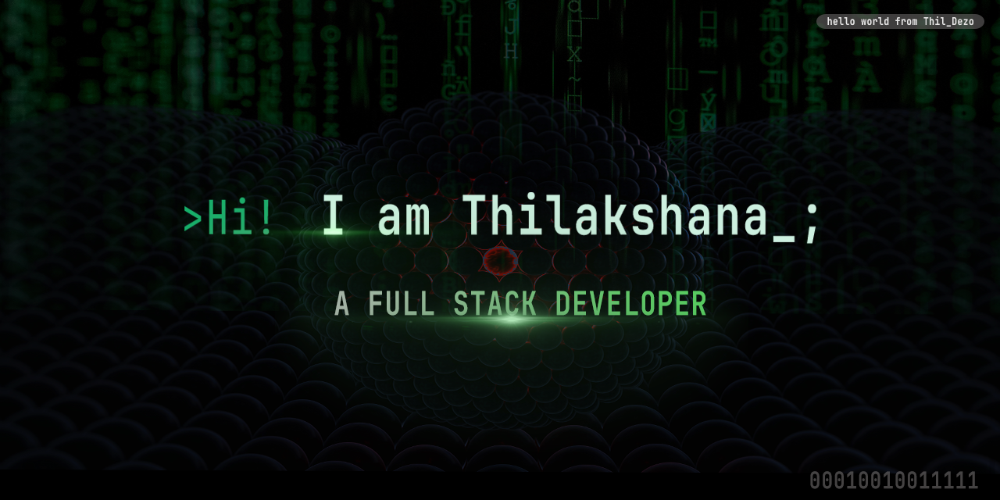

<h1>👋Hi I am Tharindu Thilakshana</h1>

👨‍💻A passionate software engineer who loves turning ideas into real-world tech solutions. I enjoy coding, building innovative projects, and continuously learning new tools and technologies. Let's connect and create something great!

## 🌐 Socials:
      

# 💻 Tech Stack:
                                          

<h1>📊 GitHub Stats:</h1>

 

## 🏆 GitHub Trophies

### ✍️ Random Dev Quote

### 🔝 Top Contributed Repo

---

# 

  ## 💰 You can help me by Donating
   

  
  <picture>
    <source media="(prefers-color-scheme: dark)" srcset="https://raw.githubusercontent.com/TharinduThilakshana0thildezo/TharinduThilakshana0thildezo/output/github-snake-dark.svg" />
    <source media="(prefers-color-scheme: light)" srcset="https://raw.githubusercontent.com/TharinduThilakshana0thildezo/TharinduThilakshana0thildezo/output/github-snake.svg" />
    
  </picture>

<picture>
  <source media="(prefers-color-scheme: dark)" srcset="https://raw.githubusercontent.com/TharinduThilakshana0thildezo/TharinduThilakshana0thildezo/output/pacman-contribution-graph-dark.svg">
  <source media="(prefers-color-scheme: light)" srcset="https://raw.githubusercontent.com/TharinduThilakshana0thildezo/TharinduThilakshana0thildezo/output/pacman-contribution-graph.svg">
  
</picture>

  

